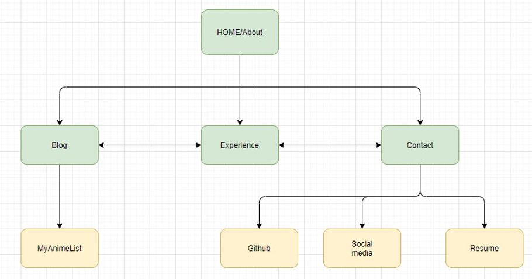

# Portfolio
Written and created by Muhammed Tayyeb Khan
**https://nifty-nightingale-05edf8.netlify.app/**

## T1A2 Assignment
**https://github.com/MTayyebKhan/Portfolio**

**Purpose**
The reason behind this portfolio is to demonsrate my *ability* to create a website portfolio about myself, demonstrating what I have learned so far and capable of creating. As the year goes on, I will further update my portfolio in line with what I can further do. Furthermore, I created something I enjoy looking at, with my limited skillset, and would enjoy seeing how much futher I will be able to develop this page into.

**Functionality/Features**
Basically created 4 linked pages that includes a home, blog, experience and a *simple* contact page for any user to understand. A nav bar that follows you down each page for easy access with a "go to top" button aswell. It has always been created to work on mobiles, tablets and desktops, with a similar color theme throughout the pages on all devices.

**Sitemap**

**Screenshots**
 

**DESKTOP**
 

**TABLET**
 

**MOBILE**
 

**Target Audience**

At the moment, my audience is my fellow peers, as I believe that there audience is myself. I wish to see what they come up with and what they are capable of doing at the moment and what inspired them aswell. Eventually, the goal is to target employers in the hopes of landing a job I will enjoy for the years to come.

**Tech Stack**
* HTML
* CSS
* SASS
* BALSAMIQ
* VSCODE
* LIVE SERVER
* NETLIFY
* GITHUB